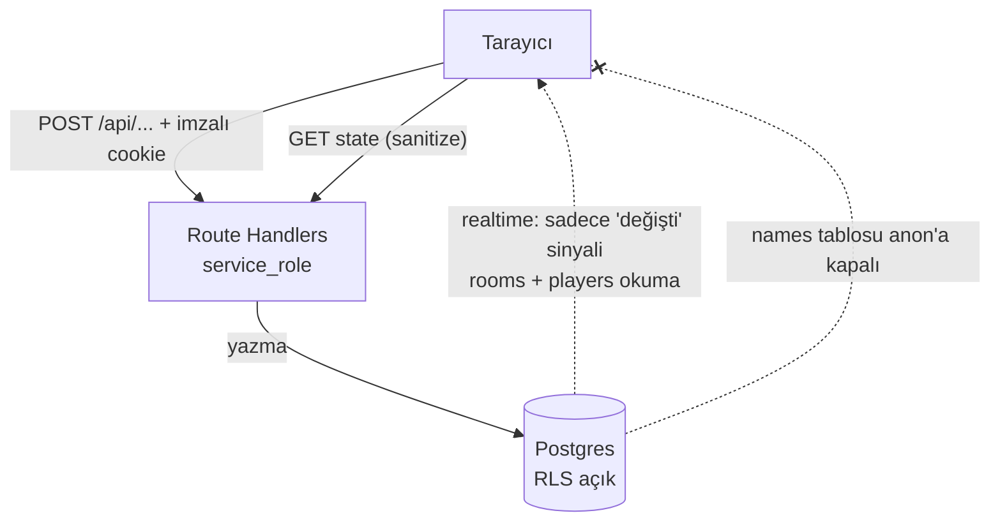

# KimBu — Faz 3: Güvenlik ve Backend Sağlamlaştırma

## Hedef mimari

Şu an tarayıcı anon key ile doğrudan Postgres'e yazıyor ve RLS kapalı. Yeni yapıda tüm yazma işlemleri sunucudan `service_role` ile gider, tarayıcı yalnızca okur.

Anon rolü `rooms` ve `players` üzerinde yalnızca `SELECT` yapabilir, bu sayede Realtime çalışmaya devam eder. `names` tablosu anon'a tamamen kapalı olduğu için cevap artık istemciye sızmaz. Realtime bir bildirim kanalına dönüştüğü için `game/[id]` içindeki 2 sn ve `room/[id]` içindeki 3 sn polling kaldırılır.

## Kimlik modeli

`localStorage.playerId` tamamen kaldırılır. Oda oluşturma/katılma yanıtında HMAC ile imzalanmış `httpOnly` cookie döner: `{ playerId, roomId, isHost }`. Her mutasyon route'u playerId'yi cookie'den türetir, gövdeden asla okumaz. Kimliğe bürünme (K3) ve istemci taraflı yetki kontrolü (K4) böylece kapanır.

## Adımlar

### 1. Sır hijyeni
`env.example` gerçek değerlerden temizlenip yer tutuculara çevrilir; `SUPABASE_SERVICE_ROLE_KEY` ve `SESSION_SECRET` eklenir (ikisi de `NEXT_PUBLIC_` **değil**). Anahtar rotasyonu ve geçmiş temizliği yapılmaz — kararlaştırıldığı gibi.

### 2. Migration altyapısı ve şema temizliği
`supabase/migrations/` oluşturulur, mevcut şema baseline olarak yazılır. Ardından:
- Ölü nesneler düşürülür: `identities` tablosu (+3 index), `players.name`, `players.assigned_identity`, `rooms.used_names`
- `players.created_at` eklenir (`/scores` sayfasının patlama sebebi)
- CHECK kısıtları: `nickname` 1–20, `name_text` 1–60 karakter, `rooms.status` enum
- `supabaseClient.ts` içindeki hayalet `game_questions` / `game_guesses` tipleri kaldırılır

### 3. RLS ve yetkiler
Dört tabloda da RLS açılır. `anon` için yalnızca `rooms` ve `players` üzerinde `SELECT` politikası; `names` üzerinde hiçbir politika yok ve `REVOKE SELECT ON names FROM anon, authenticated`. Hiçbir tabloya anon `INSERT/UPDATE/DELETE` verilmez.

### 4. Sunucu katmanı
`src/lib/` altına: `supabaseAdmin.ts` (service_role, `server-only` ile korumalı), `session.ts` (HMAC imzala/doğrula), `validation.ts` (zod şemaları), `errors.ts` (`{ error: { code, message } }` standardı), `rateLimit.ts`.

`src/app/api/` altına route handler'lar:
- `POST /api/rooms` — oda + host oluştur, cookie set et
- `POST /api/rooms/join` — koda göre katıl, cookie set et
- `GET /api/rooms/[id]/state` — **sanitize edilmiş** durum; sıradaki oyuncuya cevap gönderilmez
- `POST /api/rooms/[id]/names` — isim gönder
- `POST /api/rooms/[id]/start` — sadece host
- `POST /api/rooms/[id]/guess` — fuzzy eşleşme sunucuda, puan `score = score + 10` ile atomik
- `POST /api/rooms/[id]/pass`, `/reset`, `/leave`

Oyun mantığı `supabaseClient.ts`'ten `src/lib/game/` altına taşınır; `fuzzyMatch` ve `levenshteinDistance` saf fonksiyon olarak ayrılır (test edilebilirlik için).

### 5. Bilinen bug'ların düzeltilmesi
- **İsim çakışması kilidi:** `UNIQUE (room_id, name_text)` ihlalinde döngü kırılıp oyuncuyu kalıcı kilitliyor. Tek sorguda toplu insert + `on conflict do nothing`, yanıt hangi ismin çakıştığını bildirir.
- **Puan yarış durumu:** istemci taraflı read-modify-write yerine SQL içinde artırım.
- **N+1:** `assignNamesToPlayers` 36 ardışık UPDATE atıyor, tek toplu işleme indirilir.
- **`/scores` sahte veri:** `created_at` eklendikten sonra sorgu düzelir; uydurma liderlik tablosu fallback'i (`scores/page.tsx:46-52`) tamamen silinir.
- **Kırık `/game` linki:** `Navbar.tsx:47` ve mobil menüdeki 404 veren link kaldırılır.
- **useEffect abonelik churn'ü:** `loadRoom` bağımlılık zinciri düzeltilir, kanal bir kez kurulur.
- ~25 `console.log` temizlenir (bunlardan biri doğru cevabı loglıyor).

### 6. Rate limiting ve güvenlik header'ları
Oda oluşturma, katılma ve tahmin route'larına IP bazlı token bucket. `next.config.js` içinde `headers()` ile CSP, `X-Frame-Options`, `Referrer-Policy`, `X-Content-Type-Options` (helmet Express'e özel, burada kullanılmaz).

### 7. Testler
Vitest kurulur. Saf mantık için birim testler (fuzzy eşleşme, tur rotasyonu, isim dağıtımı) ve route handler'lar için yetki testleri: sırası olmayan tahmin edemez, host olmayan başlatamaz, cookie'siz istek reddedilir.

### 8. Bağımlılık yükseltmesi
Next 14.2.15 → 16.x, React 18 → 19 (1 critical + 3 high CVE kapanır). Ana kırıcı değişiklik: Next 15+ ile `params` artık Promise — `room/[id]`, `game/[id]`, `scores/[id]` ve tüm dinamik route handler'larda `await params` gerekir. En sona bırakılıyor ki API refactor'ü ile karışmasın.

## Kapsam dışı (sonraki fazlar)

Faz 4'e bırakılanlar: tasarım sistemi, emoji temizliği, gerçek loading/empty/error state'leri, erişilebilirlik, SEO (ana sayfa + OG etiketleri, oda sayfaları `noindex`), mobil header taşması ve `VersionDisplay` kaldırma. Faz 5: deploy ve README.

Soru/cevap turu, QR ile katılım, tur zamanlayıcısı gibi kapsam genişletmeleri ayrıca onay bekliyor.