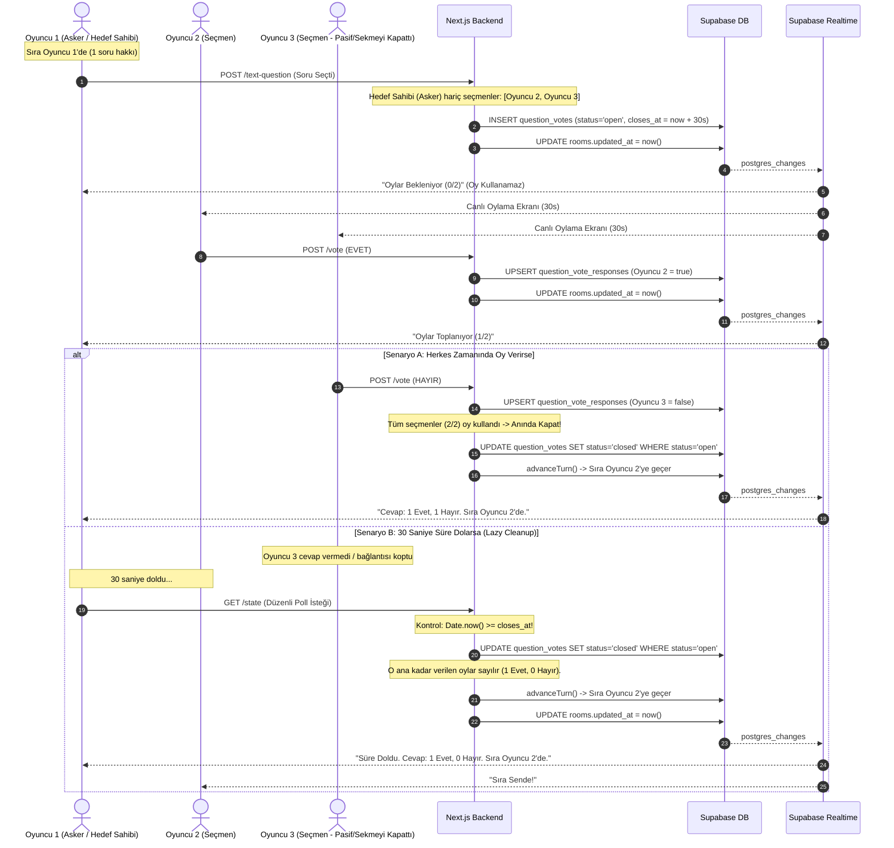
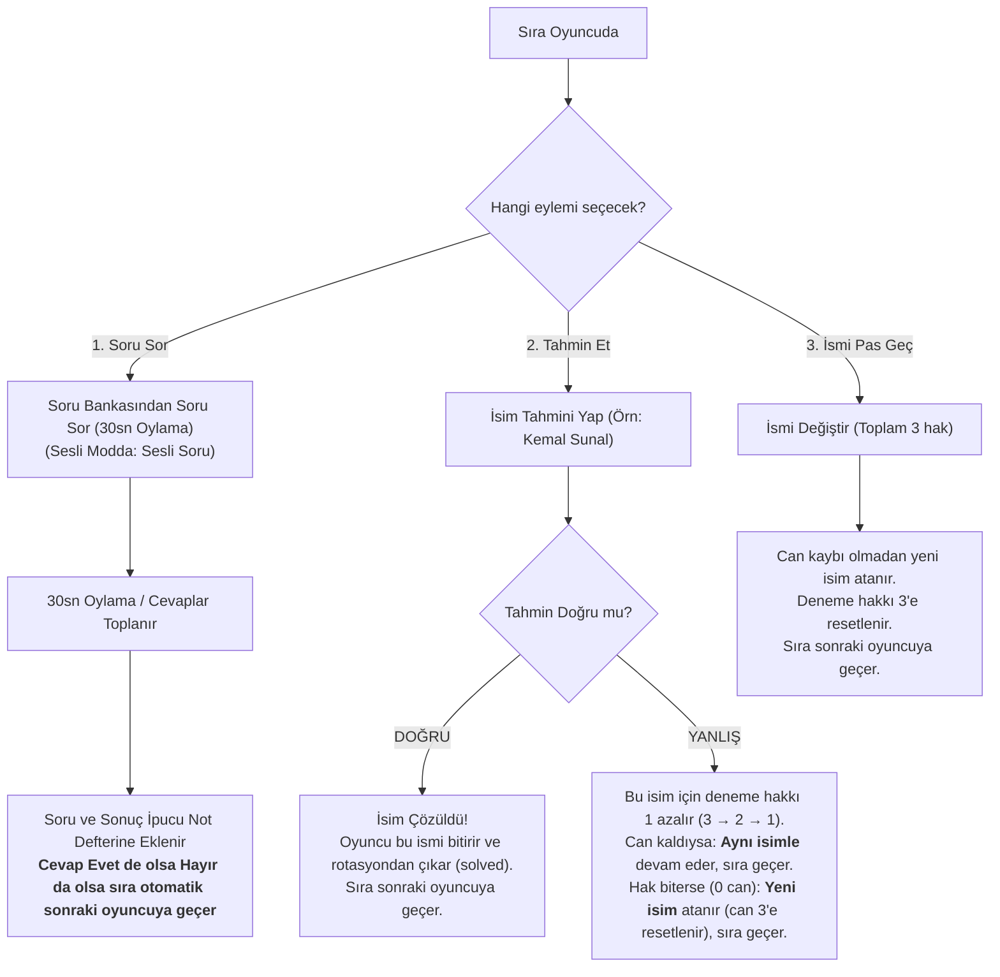

# WhoDat — Backend Mimarisi ve Oyun Akış Dokümantasyonu

Bu doküman, WhoDat oyununun sunucu mimarisini, Supabase veritabanı senkronizasyonunu, çok oyunculu canlı akışını, süre aşımı (timeout / lazy cleanup) yönetimini ve yarış durumu (race condition) korumalarını detaylıca açıklar.

---

## 1. Mimari Genel Bakış (Architecture Overview)

WhoDat, **Stateless Serverless API** (Next.js) ve **PostgreSQL + Realtime** (Supabase) katmanları üzerine kuruludur.

```mermaid
graph TD
    subgraph Clients["İstemciler (Tarayıcılar)"]
        P1["Oyuncu 1 (Asker / Hedef Sahibi)"]
        P2["Oyuncu 2 (Seçmen / Oylayıcı)"]
        P3["Oyuncu 3 (Seçmen / Oylayıcı)"]
    end

    subgraph Serverless["Next.js Serverless API (Stateless)"]
        API1["POST /api/rooms/:id/text-question"]
        API2["POST /api/rooms/:id/vote"]
        API3["GET /api/rooms/:id/state (Lazy Cleanup İçerir)"]
        API4["POST /api/rooms/:id/guess"]
        API5["POST /api/rooms/:id/pass"]
    end

    subgraph Database["Supabase PostgreSQL (Tek Doğruluk Kaynağı)"]
        DB_Rooms[("rooms")]
        DB_Players[("players")]
        DB_Names[("names")]
        DB_Votes[("question_votes")]
        DB_Responses[("question_vote_responses")]
    end

    subgraph Realtime["Supabase Realtime Engine"]
        RT_Channel["WebSocket: room:id (postgres_changes)"]
    end

    P1 -->|1. Soru Sor| API1
    P2 -->|2. Oy Ver (Evet/Hayır)| API2
    P3 -->|2. Oy Ver (Evet/Hayır)| API2
    P1 -->|Canlı State Çek| API3
    P2 -->|Canlı State Çek| API3
    P3 -->|Canlı State Çek| API3

    API1 -->|Insert Soru (status='open')| DB_Votes
    API1 -->|Realtime Tetikle: updated_at| DB_Rooms
    API2 -->|Upsert Cevap (true/false)| DB_Responses
    API2 -->|Oyları Kapat & advanceTurn| DB_Votes
    API2 -->|Realtime Tetikle: updated_at| DB_Rooms
    API3 -->|Oda & Oyuncu Durumu Oku| DB_Rooms
    API3 -->|Aktif Soru & İpucu Kartı Oku| DB_Votes
    API3 -.->|Süresi Dolmuşsa Kapat & advanceTurn| DB_Votes

    DB_Rooms -.->|Canlı Veri Değişimi| RT_Channel
    RT_Channel -.->|State Refresh Sinyali| P1
    RT_Channel -.->|State Refresh Sinyali| P2
    RT_Channel -.->|State Refresh Sinyali| P3
```

---

## 2. Yazılı İletişim Modu Oylama ve Süre Aşımı (Timeout) Akışı

### ⏱️ Oylamayı Kim Kapatıyor? (Lazy Cleanup & Serverless Mantığı)
Stateless serverless mimarisinde arka planda çalışan bağımsız bir daemon/cron süreci bulunmaz. Bunun yerine **Lazy Cleanup on Read/Action (İstek Anında Süre Kontrolü)** deseni uygulanmıştır:
1. **Herkes Oy Kullandığında:** Sonuncu seçmen `POST /vote` attığı anda oylama hemen kapatılır.
2. **Süre Dolduğunda (Biri Oy Vermezse / Sekmeyi Kapatırsa):** İstemciler her 1-2 saniyede bir `GET /api/rooms/:id/state` isteği attığı için, 30 saniye bittiğinde gelen **İLK `state` veya `vote` isteği** `Date.now() >= closes_at` olduğunu tespit eder, oylamayı otomatik sonuçlandırıp kapatır (`status = 'closed'`) ve `advanceTurn` ile sırayı bir sonraki oyuncuya geçirir. Oda **asla kilitlenmez**.



---

## 3. Yarış Durumu Koruması (Race Condition & Atomic Updates)

Aynı milisaniyede iki farklı oyuncu oy verdiğinde veya aynı anda hem `vote` hem `state` isteği geldiğinde çifte kapatma veya çifte tur devrini önlemek için **Atomik Koşullu Güncelleme** kullanılır:

```sql
-- Atomik Kapatma Sorgusu
UPDATE public.question_votes
SET status = 'closed'
WHERE id = :voteId AND status = 'open'
RETURNING *;
```

- **Nasıl Çalışır?** Bu sorguyu aynı anda 10 istek bile atsa, PostgreSQL düzeyinde **yalnızca İLK istek `1 row` döndürür**; diğer 9 istek `0 row` alır.
- Böylece `advanceTurn` fonksiyonu kesinlikle **yalnızca 1 kez** tetiklenir, çifte tur atlama imkansız hale gelir.

---

## 4. Klasik Mod Oyun ve Tur Algoritması

Klasik modda sıra oyuncuya geldiğinde **tam olarak bir aksiyon** seçer ve turunu tamamlar:



---

## 5. `rooms.current_identity_id` ve Tek Doğruluk Kaynağı (Single Source of Truth)

- **Rolü:** `rooms.current_identity_id`, o turda sıradaki oyuncunun (`current_player_id`) tahmin etmeye çalıştığı gizli kartın ID'sidir.
- **Neden Var?** Diğer oyuncular ekranlarında "GİZLİ KART: Kemal Sunal" yazısını anında ve hızlıca görebilsin diye tutulur. Sıradaki oyuncuya bu bilgi sunucu tarafından `null` olarak maskelenir.
- **Senkronizasyon:** `advanceTurn` ve `guess` işlemleri her zaman `rooms.current_player_id` ve `rooms.current_identity_id` alanlarını **aynı atomik SQL sorgusunda birlikte** günceller.
- **Yedek Doğruluk:** Eğer `current_identity_id` geçici olarak boşsa motor doğrudan `names` tablosundaki `assigned_to = current_player_id` ilişkisinden ismi çözer.

---

## 6. Veritabanı Tabloları Özeti

| Tablo Adı | Görevi ve Sorumluluğu |
| :--- | :--- |
| `rooms` | Odanın genel durumu (`status`, `game_mode`, `communication_mode`, `difficulty`, `current_player_id`, `current_identity_id`, `updated_at`). |
| `players` | Odadaki oyuncular, host durumu, skorlar, tur soru sayaçları ve cihaz kimlikleri. |
| `names` | Odaya girilen veya otomatik atanan ünlü isimleri (`assigned_to`, `used_in_round`). |
| `question_votes` | Canlı metin modu oylama oturumları (`status: open/closed`, `opened_at`, `closes_at`, `question_text`, `asker_player_id`). |
| `question_vote_responses` | Oylamaya seçmen oyuncuların verdiği EVET/HAYIR cevapları (`answer: boolean`). |
| `question_bank` | 100+ kategorize edilmiş hazır soru bankası. |
| `room_runtime` | Oda başına oyun runtime state'i (can, pas hakkı, bütçe, Ortak Hedef, açık oylama …) JSON olarak + iyimser kilit `version`. Anon'a tamamen kapalı, realtime'da yok. |

---

## 7. Runtime State ve Serverless (Oda Kapsamı)

Motor bazı state'leri hız ve basitlik için senkron bellek Map'lerinde tutar. Serverless ortamda
her istek farklı bir instance'a düşebildiği için bu Map'ler yalnızca **instance içi önbellektir**;
kalıcı kopya `room_runtime` tablosundadır (`src/lib/game/runtimeState.ts`).

- Tüm `/api/rooms/[id]/*` handler'ları `roomRoute()` ile sarılıdır; istek bir **oda kapsamında** çalışır.
- **Giriş:** DB'deki `version`, instance'ın bildiği sürümden farklıysa bellek DB'den yüklenir.
- **Çıkış:** bellek değiştiyse `update … where version = n` ile yazılır. 0 satır dönerse başka bir
  instance araya yazmıştır → `409 state_conflict`, önbellek atılır. GET istekleri bir kez yeniden denenir.
- Aynı instance'taki eşzamanlı istekler oda bazında sıraya girer; iç içe çağrılar kilitlenmez.
- Yeni bir bellek store'u eklenirse `engine.ts`'teki `registerRuntimeStores` listesine eklenmelidir,
  aksi halde instance'lar arasında taşınmaz.
